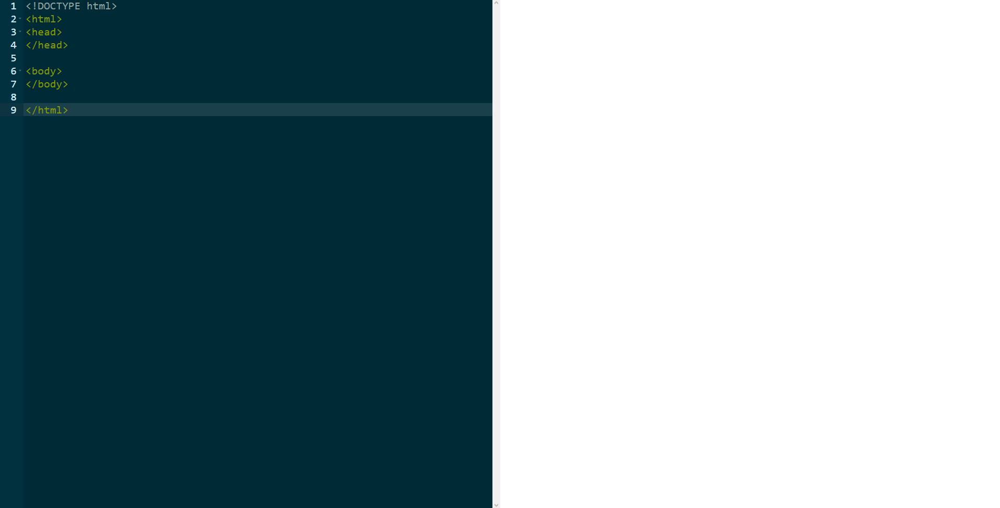
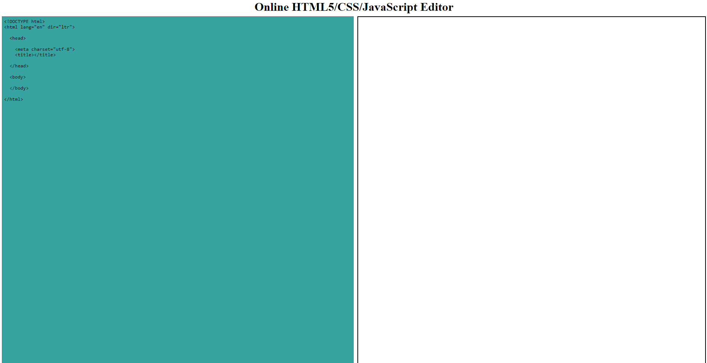

# Online HTML CSS Javascript Editor

Online editor created with [plain HTML/CSS/JS](vanillaJS) & with [editor ace plugin](editor-ace).

  <h1><a href="https://constantine.dev:8080/editor-ace"> DEMO EDITOR ACE </a></h1>

  <h1><a href="https://constantine.dev:8080/editor"> DEMO PLAIN EDITOR </a></h1>

## USAGE

Simply open the index.html file of every folder with a browser.

## Example

### Editor Ace

  

### Plain editor

  

